# <span style="color:red">The repository is under refactoring</span>
- Specific implementations in this readme will be out of date soon.
- The previous code has been moved to the `legacy` folder.

# First breaks picking
This project is devoted to pick waves that are the first to be detected on a seismogram (first breaks, first arrivals).
Traditionally, this procedure is performed manually. When processing field data, the number of picks reaches hundreds of
thousands. Existing analytical methods allow you to automate picking only on high-quality data with a high
signal / noise ratio. 

As a more robust algorithm, it is proposed to use a neural network to pick the first breaks. Since the data on adjacent
seismic traces have similarities in the features of the wave field, **we pick first breaks on 2D seismic gather**, not 
individual traces.


## Introduction

In seismic exploration, the features of wave propagation in elastic media are studied. Processing of seismic data
allows you to determine the structure and elastic properties of the studied medium.

To obtain seismic data, a source of excitation of elastic waves and a recording system are required.
In small-scale ground research, a sledgehammer is usually used as a source, and geophones as receivers.

A geophone is a device that consists of an electric coil and a permanent magnet. During the propagation of elastic
waves, the magnet inside the geophone oscillates, thereby creating an alternating current in the coil.
The signal is recorded for some time. The waveform is usually similar to the velocity or acceleration of the
oscillation of the particles of the medium (depending on the design of the geophone).

The figure below schematically shows the process of obtaining data. Geophones are placed on the profile with some
distance from the metal plate (offset). An engineer hits a metal plate with a sledgehammer, creating an elastic wave that
propagates in the medium under study. At this time, geophones record the amplitude of the signal for some time.
Records of each geophone are called a seismic trace (1D data).

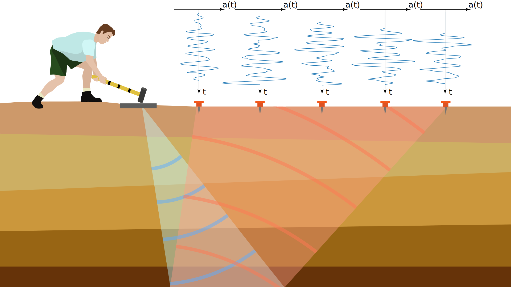

Since the data on adjacent seismic traces have similarities in the features of the wave field, it is convenient to
consider the data together. Therefore, the traces are combined into a seismogram (2D data). The trace number is
indicated on the horizontal axis, and the time of registration (in the number of samples) is indicated on
the vertical axis.

When visualizing traces in a seismogram, positive or negative amplitudes are usually indicated in black. Also,
the amplitudes of each trace are normalized to the maximum amplitude of the seismogram, or each trace is normalized
individually. Waves with large amplitudes are usually clip at the threshold.

When only the amplitude, and not the waveform, is important, a seismogram can be displayed using color.
Usually a color seismogram is drawn in grayscale.

The figure below shows the equal seismograms in wiggle and color mode.


Note that despite the square shape of the picture, it is not square. Usually, the number of samples in a trace is
several thousand, and the number of trace is 24 or more. Therefore, when displayed in color, interpolation is used.

## First break

Seismic tomography is a method of processing seismograms that allows you to determine the structure of the geological
medium and the distribution of wave propagation velocities. Also, seismograms before the appearance of the first waves
contain various noise that must be removed.

For both procedures, you must pick the first break. The first arrival is a sample on the seismic trace at which the
amplitude begins to increase for the first time and a signal is observed. Obviously, on noisy data, this definition is
meaningless.

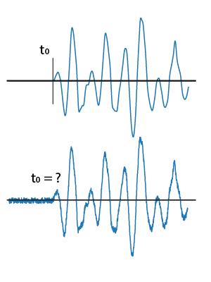

Usually, the intersection of the tangent to the signal and the time axis is used as the first break. In practice, this
approach minimizes the difference in picking between different people.

However, when learning, **we will use the start of the signal as first arrival**. Typically, in noiseless data,
picking with the tangent and with the start of the signal differs by a constant value.

## Synthetic data

For network training, a labeled data set is needed. Unfortunately, such data is not publicly available.
It is also worth noting that if the picking is performed by several people, then their results may be slightly
different due to various factors.

In this regard, we will construct a synthetic dataset and the corresponding pick. **The size of synthetic model is
1000x24**.

The figures below show examples of field data (time discretization step is 250 mcs) and manual picking with a red line.

|                                   |                                   |
|:--------------------------------- |:--------------------------------- |
|  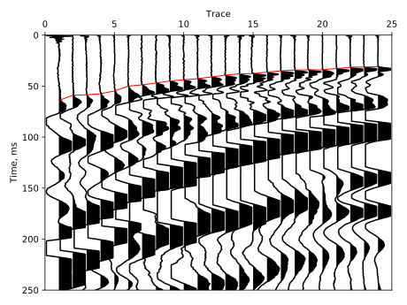 |  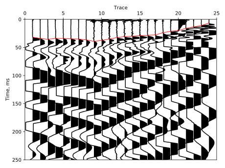 |
|  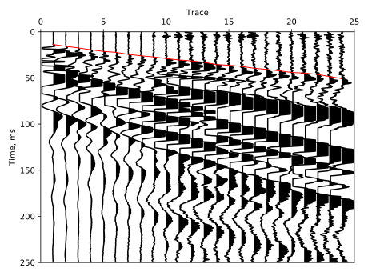 |                                   |

The following figures show noiseless synthetic data with a pick.

|                                    |                                    |
|:---------------------------------- |:-----------------------------------|
|  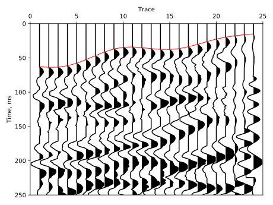 |  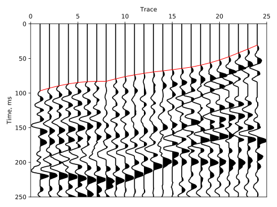 |
|  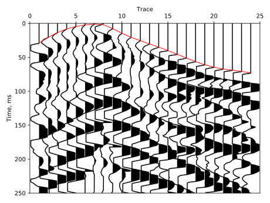 |  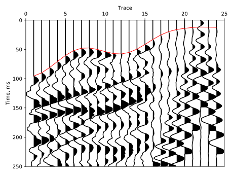 |

Synthetic data is very similar to real and can be used for training. Synthetic data also have a reliable pick. However,
in order to use the neural network on real data, it is necessary to add some transformations, which will be discussed
in the next section.

To create synthetic data, use `python data_generator.py --data_dir <folder to store data> --num_data <number of
synthetic data>`. Use `python data_generator.py --help` to view optional parameters and their defaults.

As a result, you get a set of files with *.npy* extension. Each file contains a tuple with model and picking
as *ndarray*.

## Transformations

The neural network is trained on synthetic data. In order for a picker to work correctly on real data,
it is necessary to add transformations inherent in real data.

List of possible seismogram distortions and the reasons for their occurrence:
* Random noise. \
 This noise occurs in any electronic equipment that digitizes an analog signal.

* Inversion of trace amplitude polarity.\
 When assembling geophones, an engineer can reverse the polarity of receivers.
It really happens.

* Zeroing the amplitude of the trace. \
It occurs when the geophone has an electronic circuit break.

* High noise level on some trace. \
This phenomenon occurs when a geophone is unstably inserted or not inserted on the surface.

* A powerful impulse at the beginning of recording at the same times for all traces. \
When an engineer hits a plate with
a sledgehammer, a radio signal is sent to the geophones control station about the beginning of recording. In this case,
 after hitting the sledgehammer, you must immediately raise it, avoiding weak repeated touches. If an additional touch
  has occurred, then the radio signal is again called, which also causes a false signal in the coil of geophones.
  You can see this false impulse in previous pictures with real data at a time less than 10 milliseconds.

* DC component. \
It occurs if the signal preamplifier is poorly tuned. The value of the
constant component is usually small.

* Nonlinearity of the frequency response of geophones. \
It is a mechanical characteristic of the device. In some cases, due to poor assembly, the geophone can have
a non-linear characteristic, which is difficult to formalize. Also, the geophone has resonant frequencies
at which the signal level is very high. This transformation is implemented by supplementing the sine
signal in random channels (instead of attenuating all frequencies except the resonant one).

* Signal amplitude attenuation. \
During wave propagation, the signal attenuates due to geometric divergence
(a fixed impact energy propagates throughout the medium in all directions) and energy
absorption by an inelastic medium. Also, most of the energy goes deep into the medium and
 does not return to the surface. Regardless of the cause of the phenomenon, the signal
  amplitude decays at large times (differently for different channels).

* Other interference. \
Various noises caused by a human or natural factor, including rustling grass in windy weather,
 people walking, traffic noise, etc. Data with such noise is usually rejected and not processed. Therefore, they can be
 ignored when training a neural network.

The listed transformations are implemented and added to PyTorch DataLoader. All distortions,
except orandom noise, arise only occasionally, therefore they are applied with a given probability to a random trace.
 When a sync pulse occurs, it is superimposed on all traces.

After performing the above transformations, it remains to normalize the trace amplitudes. During a manual pick, usually
the traces are normalized individually. Further, all amplitudes are multiplied by 2, this is enough to confidently
observe the first arrivals. High amplitudes are clipped at the threshold, because their values are not important for
the picking problem. These amplitude transforms are added as the last transformation in the DataLoader.

 You can set probability of transforms with `--prob_aug <value>`. If the probability is 0,
 then no transformations other than normalization are applied. Random noise is always applied if probability greater than 0.

It is worth noting that some transformations (such as amplitude zeroing, frequency response
nonlinearity, high noise and the intersection of the sync pulse with the first arrivals) make it impossible
to manually pick a trace. In such a situation, picking is not performed, or is established by
interpolation along adjacent seismic traces. Therefore, during training, we expect the neural network
to learn how to interpolate values for seismic traces with this kind of noise.

## Segmentation

The picking problem can be solved as a problem of image segmentation. Of course, various segmentation approaches are
 possible. One method is to use two classes: data before the first breaks and data after the first breaks.
 Another method is to use three classes: a narrow strip of first breaks (several samples *before* the truth first
  arrivals), data before the first breaks strip and data after the first breaks strip.

In the course of our experiments, the second approach have better quality and accuracy when processing real data than
first approach.

When working with the first approach, the first and second class have an almost equal number of pixels.
In this case, a small error in determining the boundaries of the classes does not greatly increase the loss function.

When working with the second approach, the class with a narrow strip contains very few pixels compared
to the other two. Therefore, errors in determining a narrow strip increases the loss function more strongly.
It is also useful to increase weights for a class with a narrow strip to more accurately determine the border.

At this stage, there is data for training, transformations are introduced, and classes are labeled.
Below are a few examples from the training dataset. Yellow is labeled class with data before narrow strip of first breaks,
orange is class after first breaks and brown is a narrow strip, which contain first breaks.

|                               |                                   |
|:----------------------------- |:--------------------------------- |
|  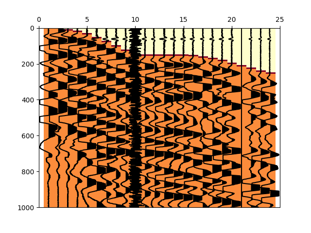 |  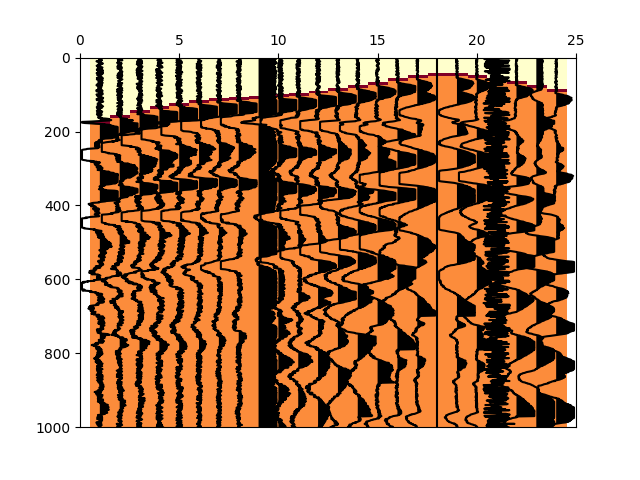     |
|  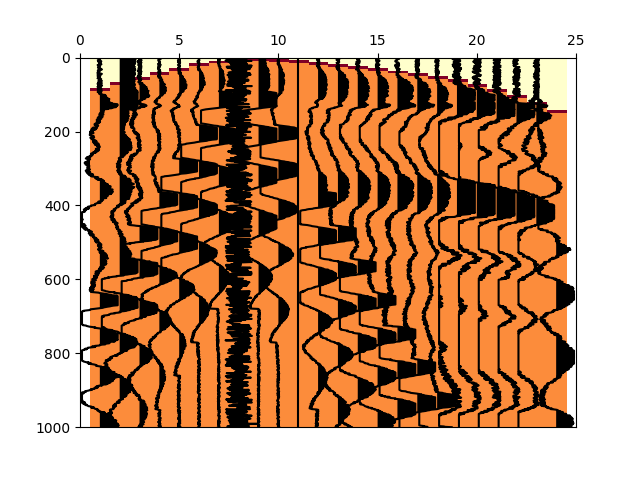 |  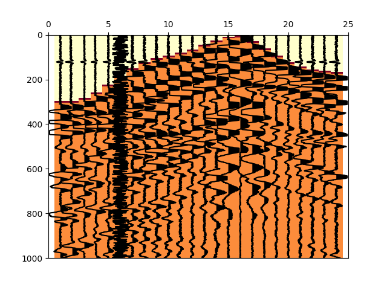     |
|  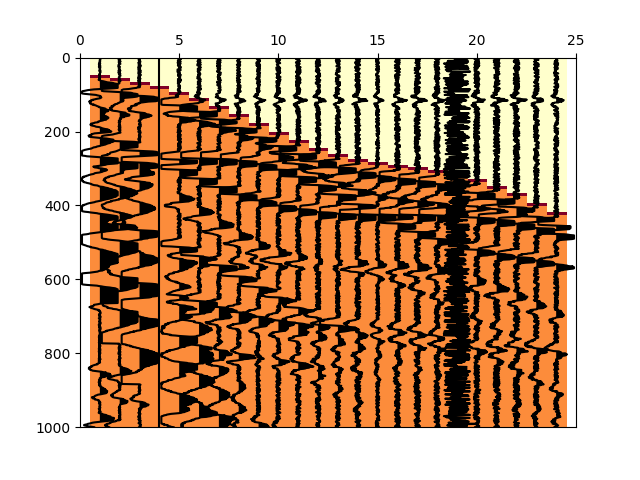 |  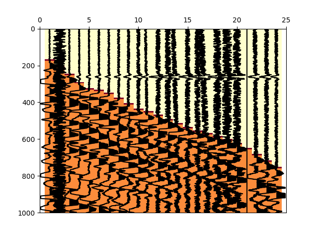     |

## Neural network architecture

It is worth noting that the amplitudes of the first arrivals and the waveform of the first arrivals are very similar
 on adjacent traces. This circumstance motivates the use of convolutional architecture.

The architecture of the used neural network is based on [U-Net](https://arxiv.org/abs/1505.04597). Unlike the original
 article, raw data is not expanded by mirroring. The depth of the model is less, as a result of which the
  transfer of features from contracting to expanding path occurs three times instead of four. Larger kernel size in the
  vertical direction are used. Also we use zero padding.

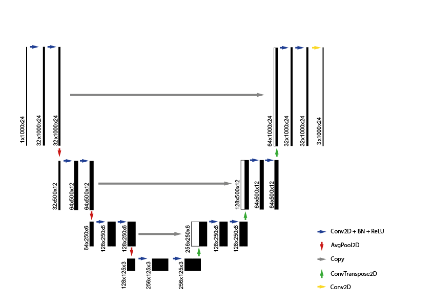

The parameters of the neural network are as follows:

* The *blue arrow* represents the sequence of 2D convolution, batch normalization and ReLU.
 The size of the convolution kernel is (9, 3), zero padding is (4, 1) and stride is 1.

* Downsampling (*red arrow*) is performed using 2D average pooling with a kernel size of 2 and a stride of 2.

* Upsampling (*green arrow*) is carried out by 2D transposed convolution with a halving of the number of channels.
The size of the convolution kernel is (7, 3), zero padding is (3, 1) and stride is 2.

* Since the size of features map does not differ, then transferring of features (*gray arrow*)
from contracting to expanding path is performed by copying.

* The mapping (*yellow arrow*) of results to 3 classes is carried out by 2D convolution with kernel size of 1 and stride of 1.

## Loss function, processing and metrics

In one of the previous sections, we said that we will solve the picking problem as a problem of image
segmentation. We will train the neural network to segment image into three classes: 0 - data before strip,
1 - data after strip and 2 - narrow strip containing the first arrivals.

To solve the segmentation problem, the pixel-wise cross-entropy loss function can be used. However, the strip with first breaks contains few pixels, so it can be difficult to
 reliably set this class. So we also try to use [Focal loss](https://arxiv.org/abs/1708.02002) that reduces the
 relative loss for well-classified examples, putting more focus on
 hard, misclassified examples. It can also be useful to use weights (`--weights <value>`) for classes since they contain an
 unbalanced number of pixels in the image.

Since we solve the segmentation problem, *Intersection over Union* (IoU) is used as one of the metrics.
It is also necessary to use additional metrics, since the main task is to correctly pick the first arrivals.

After segmentation, to determine the values of the first arrivals, and not the band of the first arrivals,
a class 1 probability map is used. For this, the probability map is binarized and the position of
the first non-zero pixel on the seismic trace is equal to the first entry. If the segmentation is perfect,
then this processing will allow you to get the exact value of the first break.

After the first arrivals are calculated, you can use metrics based on the estimation of the pick error.
For each seismogram, the *Maximum*, *Minimum*, and *RMS* errors between the real pick and the calculated one are estimated.

For a training stage, these errors are averaged over seismograms in a batch, and for a validation and test
 stage averaged over the entire corresponding dataset.

## Training

Before starting training, you need to specify a directory with synthetic data (`--data_root <path to data>`), as well as specify
the proportions in which it is necessary to split the dataset into a training, validation and test subset
 (for example `--fracs_dataset "(0.8, 0.1, 0.1)"`).

Also, since you can generate an arbitrary size dataset, you must set the validation frequency `--freq_valid <value>`.
For example, to validate at intervals of 100 training batches, set `--freq_valid 100`. If the validation
frequency is greater than 0 and more than the number of batches, then the frequency of
validation is equal to the number of batches.

During training, in addition to metrics, tensorboard displays seismograms with truth picks, calculated picks
and probability maps of class 1. You can set the frequency of visualizing and the number
of visualizations for each stage of training. For example, if `--visual "{'train': [50, 5], 'valid': [15, 4], 'test': [10, 3]}"` are set,
then 5, 4 and 3 images will be created withinterval of 50, 15 and 10 batches for train, validation and test datasets correspondingly.

When training a neural network, Adam is used as an optimizer. You can set constant learning rate with `--lr <value>`.

In order to stop the learning process in time, we will calculate the IoU on the validation dataset. If the IoU does not increase
over a certain number of validation by a certain amount, then learning stops.

## Results

#### Training loop

To train the neural network, a synthetic dataset with 30000 seismograms was generated.

Picker was trained with the following common parameters:

```
--lr 1e-3 \
--batch_size 60 \
--aug_degree 0.8 \
--num epoch 3 \
--fracs_dataset "(0.8, 0.1, 0.1)" \
--freq_valid 100
```

With these parameters, the training dataset consists of 400 batches, and validation is performed at intervals of 100 batches.

As noted, the number of pixels in the classes is unbalanced, so we compare the two loss functions (cross-entropy loss - CEL and focal loss - FL) with different weights.
The width of the strip is 8 pixels, and the length of the trace is 1000 pixels, so we will use the weight `(1000 - 8) / 1000 = 0.992`.
For the other two classes we use the same weights `(1 - 0.992) / 2 = 0.004`. Compare the results with and without weights.

IoU for validation dataset is presented below. Gray line - FL with weights, blue line - CEL with weights, pink line - FL without weights and red line - CEL without weights.

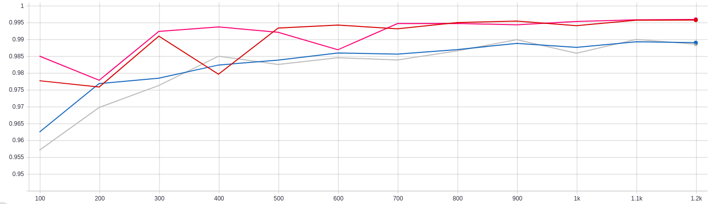

RMS error in picking for validation dataset is presented below. Green line - FL with weights, orange line - CEL with weights, pare blue line - FL without weights and blue line - CEL without weights.

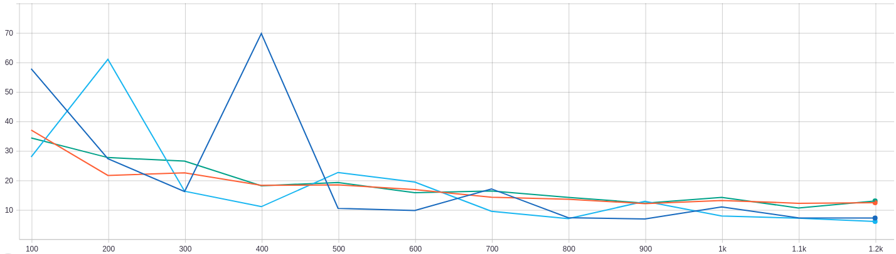

As you can see, the choice of the loss function affects only the beginning of training,
but by the end of training the metrics are almost equal. It is worth noting that without weights,
the metrics are higher, although not significantly (IoU is 1% higher, the error is less by 5 samples).

#### Real data tests

It is necessary to test the picker on real data. For this, a picked seismogram consisting of 96 traces is used,
which is splitted into 4 segments with 24 channels. Each segment was processed by a neural network trained in four ways:
FL with weights, FL without weights, CEL with weights and CEL without weights.

For each case, a seismogram (zoomed to 400 samples after segmentation) with a real
pick (blue line), a calculated pick (green line) and a probability map for class 1 are presented below.

Based on the real pick and the calculated pick, the error vector is estimated. The error vector
consists of 24 elements, each element of which is equal to the absolute value of the difference between
the real and the calculated pick for the trace.

Each figure shows the median, mean, minimum and maximum values of the error vector.
Since some traces can be picked fairly accurately, while others are inaccurate, the mean and
median values are also calculated based on the 12 largest and 12 smallest elements of the error vector.

Before considering the results, it is worth noting that the error in manual picking can be up to 3 samples
when picking by different people. If the signal is quite complex and noisy, the difference in the pick can be greater.
Even the presented manual pick may differ if it is performed by another person.

| Traces 1 - 24   | Weights = (1, 1, 1)                  | Weights = (0.004, 0.004, 0.992)   |
|:----------------|:------------------------------------ |:----------------------------------|
|CrossEntropy loss|  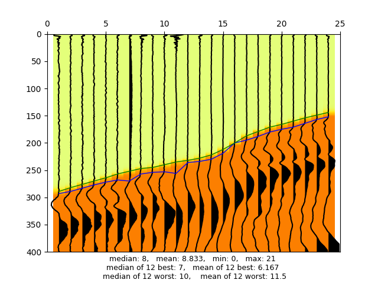  |  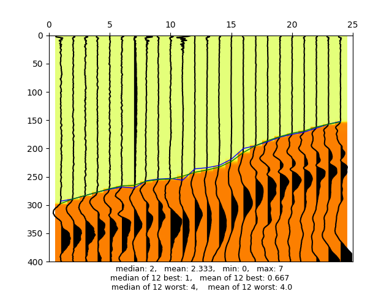  |
|Focal loss       |     |     |

In this segment (1 - 24), when using weights, picking very well coincides with manual picks.
For traces from 11 to 16, the largest errors were made. It is worth noting that
on these traces the impulse of the first arrivals waves is very long and does not have a sharp initial front.
Such situations are very complex and ambiguous when picking.

| Traces 25 - 48  | Weights = (1, 1, 1)                   | Weights = (0.004, 0.004, 0.992)    |
|:----------------|:------------------------------------- |:-----------------------------------|
|CrossEntropy loss|    |  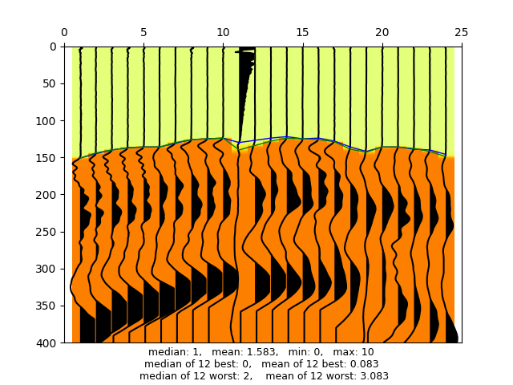  |
|Focal loss       |     |  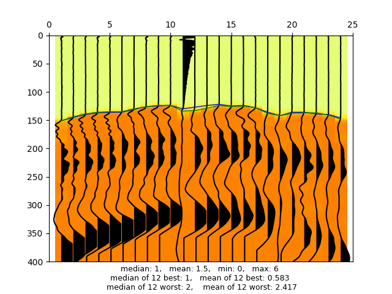   |

In the 25-48 segment, the best pick was also made using a neural network with weights.
There is a faulty channel with number 11, the presence of which did not affect the accuracy of the pick.
Picking on this channel may either not be performed, or performed with interpolation. However, when using the focal
 loss, the picking error on adjacent traces turns out to be less.

| Traces 49 - 72  | Weights = (1, 1, 1)                   | Weights = (0.004, 0.004, 0.992)    |
|:----------------|:------------------------------------- |:-----------------------------------|
|CrossEntropy loss|    |  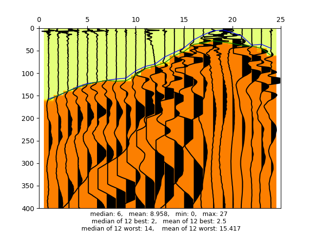  |
|Focal loss       |  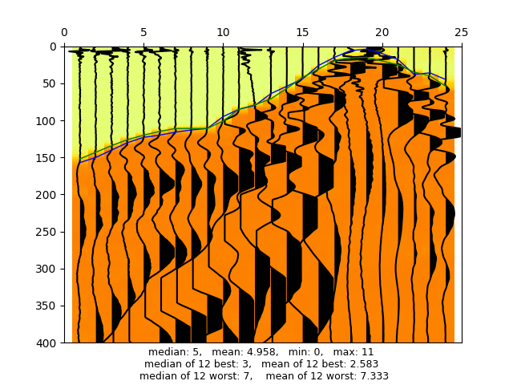   |  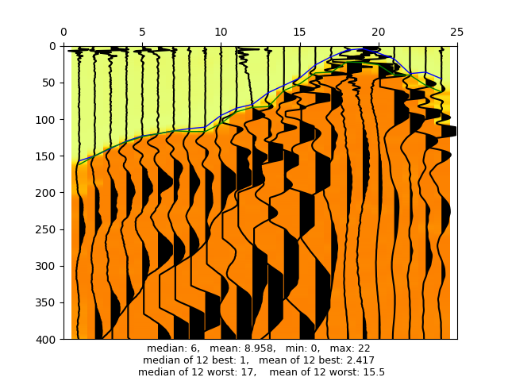   |

On segment 3 (traces 49 - 72), there are a lot of features that can complicate the pick. Firstly, t
races 1 to 9 contain a sync pulse at the beginning, which was successfully ignored during a picking.
On channel 12 there is a high noise at the beginning, however, the channel is operational and has been precisely picked.

The channels on the right half of the seismogram were located near the seismic source.
The signal on them is complex and varies greatly on each trace. In this section of the seismogram,
a neural network trained without weights did well picked. At the same time, a section far from the source
is still well picked by a neural network with weights.

| Traces 73 - 96  | Weights = (1, 1, 1)                   | Weights = (0.004, 0.004, 0.992)    |
|:----------------|:------------------------------------- |:-----------------------------------|
|CrossEntropy loss|  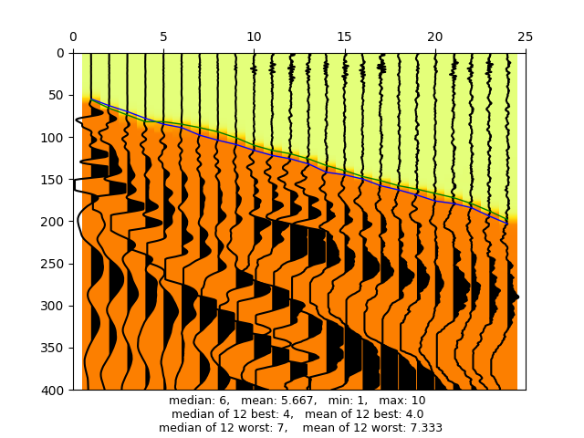  |  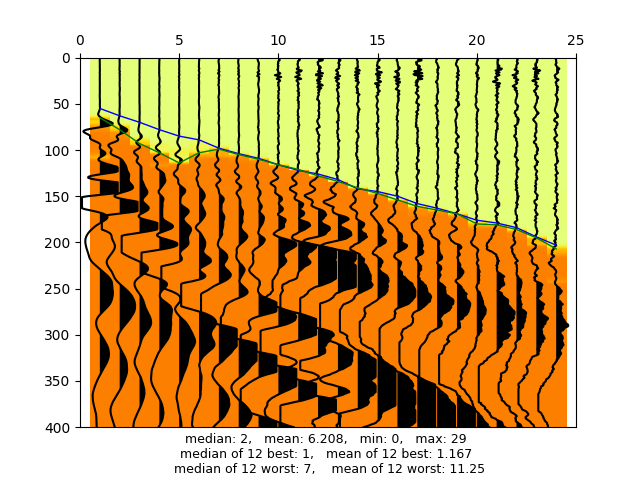  |
|Focal loss       |  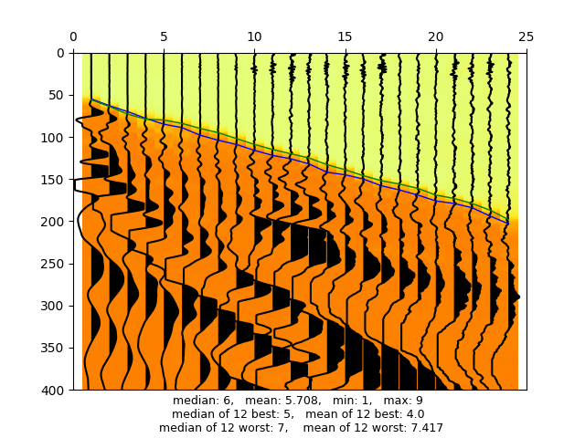   |     |

The last segment (73 - 96) contains many traces with high noise before the first arrivals.
At the same time, neural networks with weights very accurately picked these traces.
It is very strange that the pick is absolutely wrong on the left side of the seismogram with using weights.
However, without the use of weights, it is accurate.

We present the error vector for the entire seismogram:

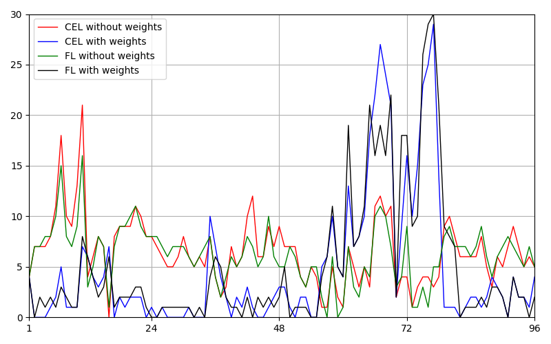

#### Data transformations for generalization

It is interesting to note the contribution of some transformations to the generalization of the model to real data.

Below are two figures obtained by a neural network during the training of which energy absorption and distortion by a low-period sine were not used.
The training parameters are the same as in the previous section. The Focal loss with weights are used.

|                                          |                                          |
|:---------------------------------------- |:---------------------------------------- |
|  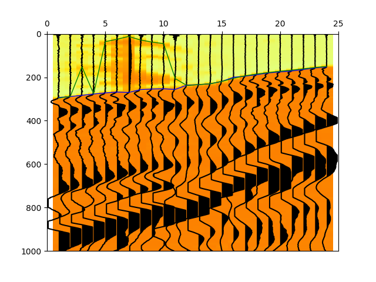 |  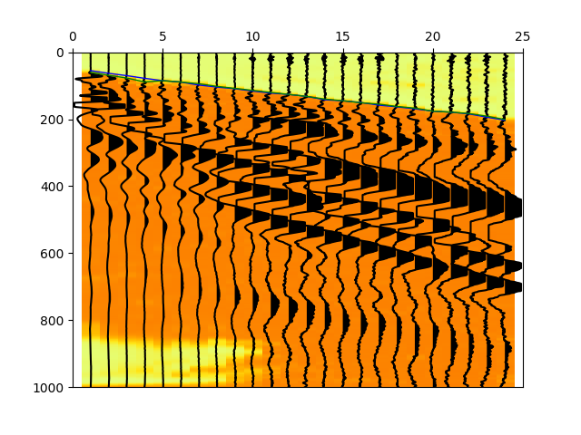 |

The figure on the left shows that trace 7 is incorrectly segmented, due to there is no
low-period interference in the training. It also distorts the segmentation of adjacent traces.
Probably, the error extends to adjacent traces during upsampling.

The figure on the right shows that on the left side of the seismogram with a time of more than 800 samples,
the signal has a low amplitude. The neural network determined that the low-amplitude area is not class 1.
If you look at another map (not shown), then this region corresponds to class 0. It turns out that the neural
network has learned to define class 0 as a low-amplitude data area, not a area before the first arrivals.

## Conclusions

Based on the test results, the following conclusions:

* The using of weights significantly increases the accuracy of the pick.

* For both loss functions, approximately the same accuracy is obtained.
In some cases, when using FL, mean and median of 12 worst errors turn out to be less.

* The traces near the seismic source are incorrectly picked by a neural network with weights.
It is necessary to conduct fine tuning to improve the result.

* When using FL, a smoother probability map is also obtained. The probabilities of CEL are more sharp.
This result is expected based on the formulae for the loss function. However, with the same processing, almost the same results are obtained.

To improve neural network accuracy on picking data obtained near seismic source, it is worth trying the following modifications:

* Increase weights for class 1 in order to better define the signal area.

* Use a broadband signal near the source, but for this it is necessary to modify the data generator.

* Modify the architecture of the neural network: change kernel size, add dilation, etc.

* Instead of using padding with zeros, mirror the borders of the original image.

