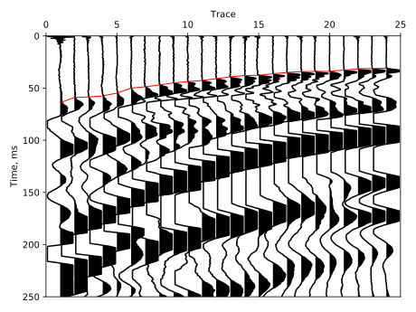
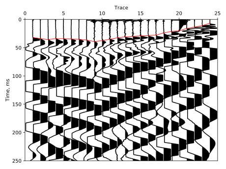
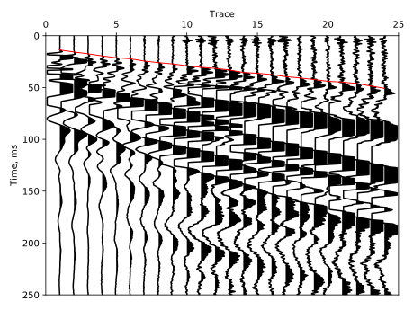
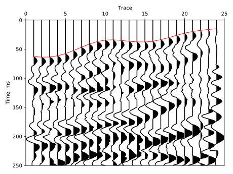
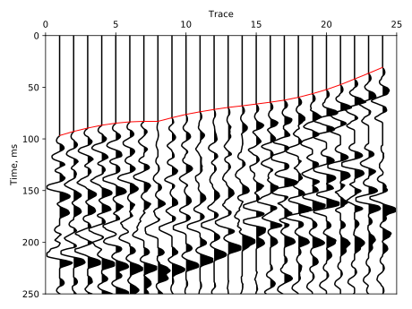
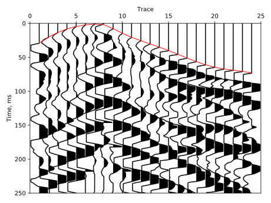
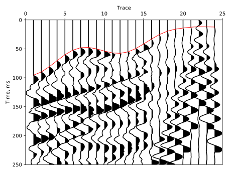

# First break picking
This project is devoted to pick waves that are the first to be detected on a seismogram (first breaks, first arrivals).
Traditionally, this procedure is performed manually. When processing field data, the number of picks reaches hundreds of
thousands.

The figures below show examples of field data and manual picking with a red line.

It is proposed to build a neural network to pick the first arrivals. 
For network training, a labeled data set is needed. Unfortunately, such data is not publicly available.
It is also worth noting that if the picking is performed by several people, then their results may be slightly 
different due to various factors.

In this regard, we will construct a synthetic data set and the corresponding pick. The following figures show 
noiseless synthetic data with a pick.

