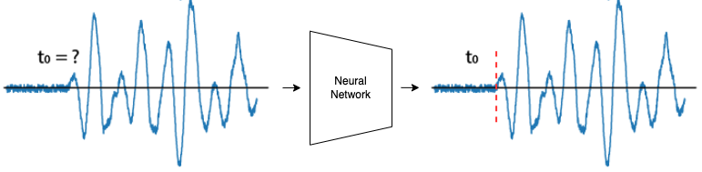

## Introduction

You are on a page with a demo application for automatic first breaks picking with a neural network. 

The problem formulation and solution are described in the repository: https://github.com/DaloroAT/first_break_picking. 
However, in this demo, we use modern architecture, and the model itself is trained on real land seismic data 
instead of synthetic ones.
