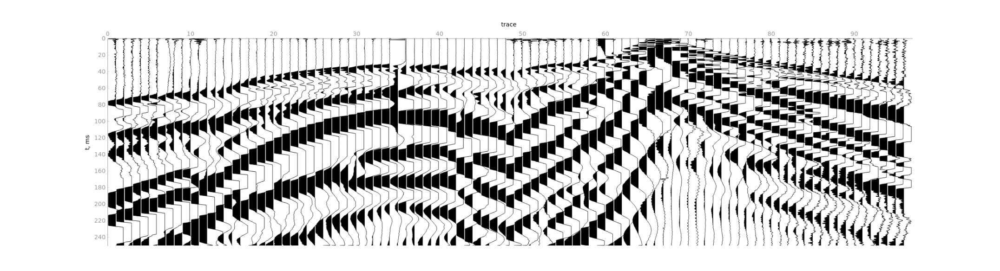
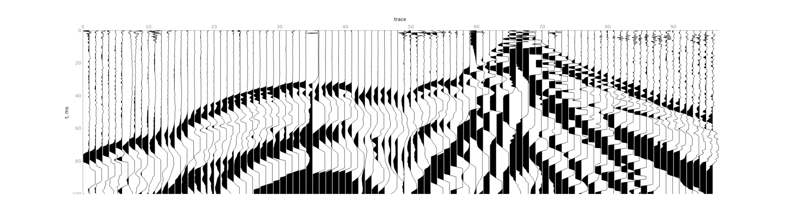
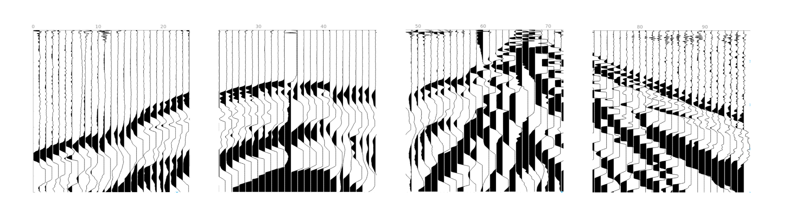
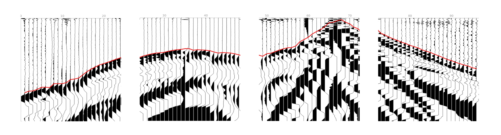
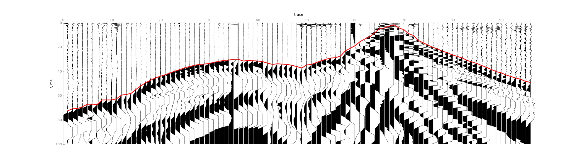
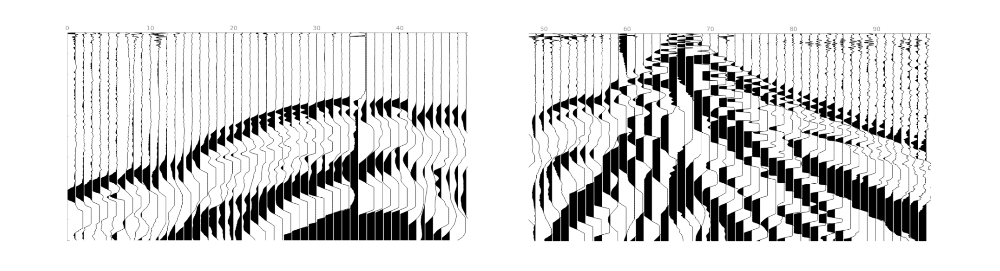
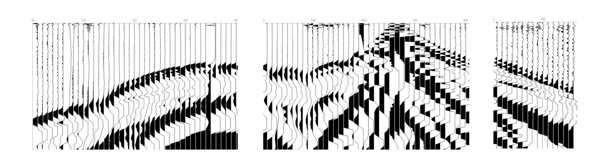

## Picking process

Neural network process file as series of **images**. There is why **the traces should not be random**,
since we are using information about adjacent traces.

To obtain the first breaks we do the following steps:
1) Read all traces in the file.

2) Limit time range by `Maximum time`. 

3) Split the sequence of traces into independent gathers of lengths `Traces per gather` each. 

4) Apply trace modification on the gathers level if necessary. 
5) Calculate first breaks for individual gathers independently.

6) Join the first breaks of individual gathers.

To achieve the best result, you need to modify the picking parameters.

### Traces per gather

`Traces per gather` is the most important parameter for picking. The parameter defines how we split the sequence of 
traces into individual gathers. 

Suppose we need to process a file with 96 traces. Depending on the value of `Traces per gather` parameter, we will 
process it as follows:
- `Traces per gather` = 24. We will process 4 gathers with 24 traces each. 

- `Traces per gather` = 48. We will process 2 gathers with 48 traces each.

- `Traces per gather` = 40. We will process 2 gathers with 40 traces each and 1 gather with the remaining 16 traces. 
The last gather will be interpolated from 16 to 40 traces. 

### Maximum time

You can localize the area for finding first breaks. Specify `Maximum time` if you have long records but the first breaks
located at the start of the traces. Keep it `0` if you don't want to limit traces.

### List of traces to inverse

Some receivers may have the wrong polarity, so you can specify which traces should be inversed. Note, that inversion 
will be applied on the gathers level. For example, if you have 96 traces, `Traces per gather` = 48 and
`List of traces to inverse` = (2, 30, 48), then traces (2, 3, 48, 50, 78, 96) will be inversed.

Trace indexing starts at 1.

## Recommendations
You can receive predictions for any file with any parameters, but to get a better result, you should comply with the 
following guidelines:
- Your file should contain one or more gathers. By a gather, we mean that traces within a single gather can be 
geophysically interpreted. **The traces within the same gather should not be random**, since we are using information 
about adjacent traces.
- All gathers in the file must contain the same number of traces.
- The number of traces in gather must be equal to `Traces per gather` or divisible by it without a remainder. 
For example, if you have CSP gathers and the number of receivers is 48, then you can set the parameter 
value to 48, 24, or 12.
- We don't sort your file (CMP, CRP, CSP, etc), so you should send us files with traces sorted by yourself. 
- You can send a file with independent seismograms obtained from different polygons, under different conditions, etc., 
but the requirements listed above must be met.
